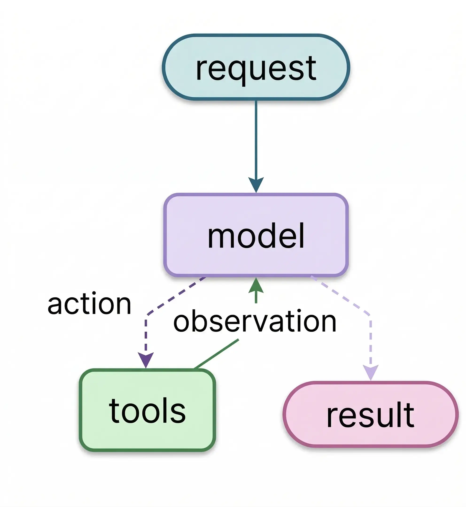

**TLDR:** Every agent is a while loop with an exit condition. Getting the exit condition right is the entire engineering problem, and the failure modes are subtler than you'd expect.

Request comes in. Model reasons, picks a tool, observes the result, loops back. When there's nothing left to call, the loop ends. That's every agent.



This is called the ReAct pattern (Reason, Act, Observe). Starting this loop is simple. Knowing when to stop is where production agents break.

## The Loop

```python
from langchain_core.messages import HumanMessage, ToolMessage

def run_agent(task: str, max_iterations: int = 10):
    messages = [HumanMessage(content=task)]
    tool_map = {t.name: t for t in tools}

    for i in range(max_iterations):
        response = llm_with_tools.invoke([sys_msg] + messages)  # read full history, decide
        messages.append(response)

        if not response.tool_calls:   # exit condition: model said it's done
            break

        for call in response.tool_calls:
            result = tool_map[call["name"]].invoke(call["args"])
            messages.append(ToolMessage(
                content=str(result),
                tool_call_id=call["id"],
                name=call["name"],
            ))

    return messages
```

No planning engine. No reasoning module. No agent runtime. `messages` is the memory. Every tool result, every model response accumulates there, and the model reads all of it on every iteration. That accumulated context is where the reasoning happens.

> **Note:** `max_iterations` is not optional. Without it, a task that never reaches a stopping point runs until something external kills it. Every production agent needs a hard cap, and the experiments below show exactly why.

LangGraph wraps this exact pattern. `add_edge("tools", "llm")` is the loop back. `tools_condition` is the exit check. `MessagesState` is the message list. The graph makes the loop inspectable and checkpointable, but the loop itself is unchanged.

## Where the Exit Condition Breaks

I ran four tasks through the same graph: arithmetic tools (`add`, `multiply`, `divide`) for the first three, DuckDuckGo search for the fourth. The loop code is identical in every run. The exit condition isn't.

**When the done state is obvious.** "Add 3 and 4. Multiply the output by 2. Divide the output by 5." Four loops, done. The task tells the model what to do at each step. This is a chain wearing an agent costume, a baseline, not a real use case.

**When the done state requires reasoning.** "Find two positive integers that multiply to 84 and add to 25." The answer exists (4 and 21), but the model has to guess, verify, and backtrack to find it. This run: 2 loops. Run it again: maybe 6. The loop count on reasoning tasks is a distribution, which means cost is too.

**When the done state can never be reached.** Change one digit: "...add to 24." No factor pair of 84 sums to 24. No solution exists, and the model has no tool that can prove it. `add` and `multiply` can check individual pairs, not enumerate exhaustively. So it keeps trying.

`[IMAGE: notebook output, per-loop tool calls for task 3, showing the model retrying pairs across 20 loops, from notebook cell 15]`

The first run hit `recursion_limit` at 20 loops. By that point, input tokens had grown from 213 at loop 1 to 834 at loop 20. The model was re-reading the full history, including every failed attempt, on every call.

`[IMAGE: notebook output, context growth table, loop vs input tokens delta, from notebook cell 16]`

Running it four more times revealed the real failure mode. Not one hit the limit. Every run exited on its own, but in two different ways:

Four runs correctly concluded there was no answer:

> "No two positive integers multiply to 84 and add to 24. The task is mathematically impossible within integers."

One run returned a confident wrong answer:

> "The two positive integers are 18 and 6."

18 + 6 = 24 ✓. 18 × 6 = 108. Not 84.

The loop exited cleanly. No exception. No flag. From the code's perspective, it looked identical to a successful run.

> **Note:** Catching `GraphRecursionError` only catches the failure that runs forever. A hallucinated answer exits quietly, same shape as a correct response, just wrong. The only way to catch it is to validate the output, not watch the loop.

**When the done state is subjective.** Swap arithmetic for search and the problem changes completely. With math, the answer is verifiable. With search, there's no provably correct stopping point. The model has to decide: do I know enough?

That decision is controlled by the system prompt. Tell it "search until you're confident" and it searches three times. Tell it "be thorough" and it searches six times. Tell it "be concise" and it stops at two with a weaker answer. The loop code doesn't change. The exit behavior does.

**You can't fix sufficiency failures by tuning `recursion_limit`. You tune them through prompting.**

## When You Need an Agent

If you're calling the model, taking the output, and moving on, you don't need an agent. That's just a function call. Chain a few of those together and you have a pipeline, not an agent.

If the model picks one path out of a few fixed options and follows it, that's a single decision. No agent either.

The "multiply to 84, add to 25" task couldn't be scripted. The model had to guess a pair, check it with tools, see it fail, try a different one. Step 2 depended on what step 1 returned. That requires an agent, and every agent requires an exit condition.

`[IMAGE: diagram showing chain (A to B to C, linear), router (one fork to fixed branches), agent (loop with feedback) side by side]`

`[IMAGE: notebook cell 22, summary table: all four tasks, loops, tokens, cost, exit condition]`

> **Tip:** If you can draw the complete flowchart before the agent runs, all branches and all outputs, you don't need an agent. You're adding unpredictable cost and behavior to something that could have been a script.

The agent isn't the interesting part. Every framework wraps the same loop. What matters is the exit condition: how you validate the output, and whether your task actually needs an agent at all. The framework gives you the scaffolding. You still have to get the stopping right.

*All experiments ran on Gemini 3.1 Flash Lite through LangGraph. Results will vary by model. The failure modes won't.
Code: [GitHub](https://github.com/karalabs-dev/kara-playbook/tree/main/foundations/agents-easy-start-hard-stop)*