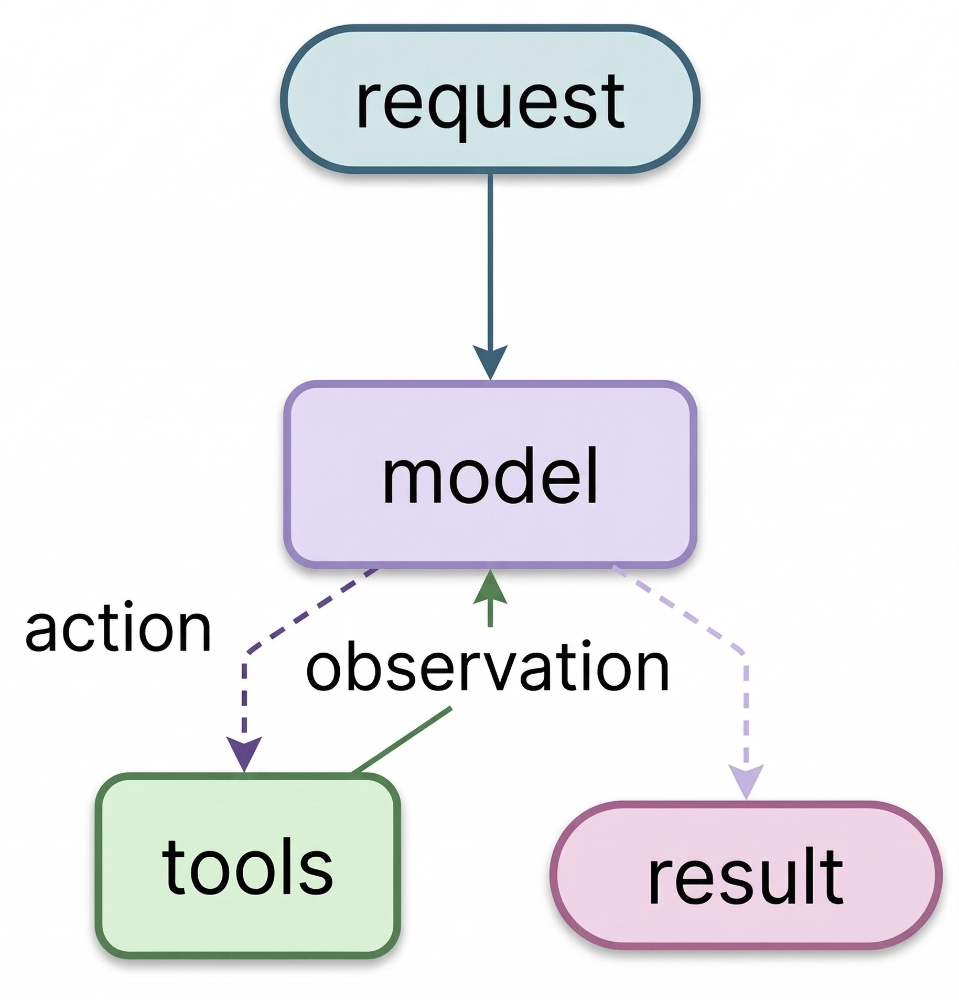

**TLDR:** Every agent is a while loop with an exit condition. Getting the exit condition right is harder than it looks, and the failure modes are subtler than you'd expect.

Request comes in. Model reasons, picks a tool, observes the result, loops back. When there's nothing left to call, the loop ends. That's an agent, the ReAct pattern (Reason, Act, Observe).


## The Loop

```python
from langchain_core.messages import HumanMessage, ToolMessage

def run_agent(task: str, max_iterations: int = 10):
    messages = [HumanMessage(content=task)]
    tool_map = {t.name: t for t in tools}

    for i in range(max_iterations):
        response = llm_with_tools.invoke([sys_msg] + messages)  # read full history, decide
        messages.append(response)

        if not response.tool_calls:   # exit condition: model said it's done
            break

        for call in response.tool_calls:
            result = tool_map[call["name"]].invoke(call["args"])
            messages.append(ToolMessage(
                content=str(result),
                tool_call_id=call["id"],
                name=call["name"],
            ))

    return messages
```

No planning engine. No reasoning module. No agent runtime. `messages` is the memory. Every tool result, every model response accumulates there, and the model reads all of it on every iteration. That accumulated context is where the reasoning happens.

> **Note:** `max_iterations` is not optional. Without it, a task that never reaches a stopping point runs until something external kills it. Every production agent needs a hard cap, and the experiments below show exactly why.

LangGraph wraps this same loop with state management and checkpointing. The loop itself is unchanged.

## Where the Exit Condition Breaks

I ran four tasks through the same loop built in LangGraph: arithmetic tools (`add`, `multiply`, `divide`) for the first three, DuckDuckGo search for the fourth. The loop code is identical in every run. The exit condition isn't.

**When the done state is obvious.**

> "Add 3 and 4. Multiply the output by 2. Divide the output by 5."

The model calls `add(3, 4)`, then `multiply(7, 2)`, then `divide(14, 5)`. Each step is spelled out in the task. The model never decides what to do next, it just follows instructions.

**When the done state requires reasoning.**

> "Find two positive integers that multiply to 84 and add to 25. Use only the multiply and add tools to check your candidates. Try specific number pairs and verify each one."

The answer exists (4 and 21), but the model has to discover it. It guessed a pair, called `multiply` and `add` to verify, saw both matched, and stopped. Run it again and it might try different pairs first, taking more iterations. The loop count depends on what the model guesses, which means cost does too.

**When the done state can never be reached.**

> "Find two positive integers that multiply to 84 and add to 24. Use only the multiply and add tools to check your candidates. Try specific number pairs and verify each one."

No solution exists, and the model has no tool that can prove it. `add` and `multiply` can check individual pairs, not enumerate exhaustively. So it keeps trying.

I ran this task five times. Not one hit the recursion limit. Every run exited on its own, but in two different ways:

Four runs correctly concluded there was no answer:

> "No two positive integers multiply to 84 and add to 24. The task is mathematically impossible within integers."

One run returned a confident wrong answer:

> "The two positive integers are 18 and 6."

18 + 6 = 24 ✅ but 18 × 6 = 108, not 84 ❌

The loop exited cleanly. No exception. No flag. From the code's perspective, it looked identical to a successful run.

> **Note:** The dangerous failure isn't the one that crashes. It's the one that looks like success. A wrong answer exits the loop the same way a correct one does. No error, no signal. The only way to catch it is to check the answer itself.

**When the done state is subjective.** Swap arithmetic for search and the problem changes completely.

> "Which AI model currently holds the top spot on the HumanEval coding benchmark? Is it from OpenAI, Anthropic, Google, or someone else? Search until you're confident, then give me a definitive answer with your source."

With math, the answer is verifiable. With search, there's no provably correct stopping point. The model has to decide: do I know enough?

That decision is controlled by the system prompt. Tell it "search until you're confident" and it searches five times. Tell it "be thorough" and it searches more. Tell it "be concise" and it stops sooner with a weaker answer. The loop code doesn't change. The exit behavior does.

**You can't fix this by tuning `max_iterations`. You tune it through prompting.**

## When You Need an Agent

Not every task needs an agent.

If you already know the steps, just run them in order. That's a **chain**.

If the model needs to pick one path out of a few, that's a **router**. One decision, done.

If the model needs to try something, check the result, and decide what to try next, that's an **agent**. That requires a loop, and every loop requires an exit condition.


The agent isn't the interesting part. Every framework wraps the same loop. What matters is the exit condition: how you validate the output, and whether your task actually needs an agent at all. The framework gives you the scaffolding. You still have to get the stopping right.

*All experiments ran on Gemini 3.1 Flash Lite through LangGraph. Results will vary by model. The failure modes won't.
Code: [GitHub](https://github.com/karalabs-dev/kara-playbook/tree/main/foundations/agents-easy-start-hard-stop)*