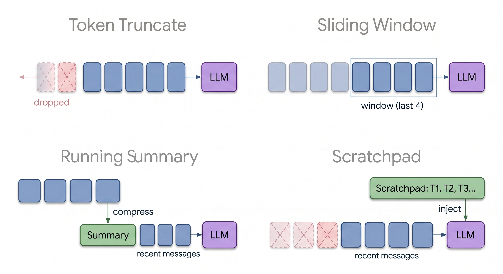
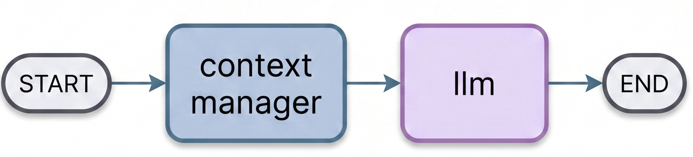

**TLDR:** An agent learns 10 facts, then gets quizzed on them across the next 20 turns. Four ways to manage the growing context. Every one of them fails differently. None retain everything for free.

An agent's memory is its message history. Every turn appends to it, and every turn the model re-reads all of it. Every turn pays all previous turns. Eventually the context grows past the budget and something has to be cut, summarized, or moved out of the conversation entirely. The four strategies below handle that differently, and the one with perfect recall isn't the one you'd pick for a real system.

## The Experiment

A LangGraph agent is taught 10 facts about a fictional framework called AgentForge across the first 10 turns. Then it gets quizzed for 20 more turns. Questions start with the most recent facts and work backwards, ending with a recall test on the very first turn. A fictional framework so the model can't fall back on training data, every correct answer has to come from the conversation itself.

To force the strategies to actually do something, I capped the context window at 1,400 tokens. Real models have much larger windows, but at full size none of the strategies would activate before the conversation ended. The cap simulates what happens when conversations grow past the limit.

Same graph for all four strategies. One node manages context, the next node calls the LLM:

Only the `context_manager` node changes between runs. Everything else is identical, same model, same task, same prompt.

## The Four Strategies

**Baseline (Token Truncate)** drops the oldest messages when the context exceeds the budget. No intelligence, no preservation. The default if you don't write a context manager at all.

**Sliding window** keeps the last 12 messages and drops everything else. Predictable, but anything that falls out of the window is gone forever.

**Running summary** uses an LLM to compress older messages into bullet points, keeping the last few verbatim. The summary replaces raw history. Lossy, but the loss is structured.

**Scratchpad** gives the agent two tools, `write_scratchpad` and `read_scratchpad`. Facts get saved to a state field outside the message history. Old messages still get trimmed by a sliding window, but the scratchpad survives and gets injected into the system message every turn.

## Results

| Strategy | Accuracy | Retention | Tokens | Cost | Recent | Mid | Early Recall |
|----------|----------|-----------|--------|------|--------|-----|--------------|
| Baseline (Token Truncate) | 0.50 | 0.00 | 25,780 | $0.003 | 0.67 | 0.14 | 0.00 |
| Sliding Window | 0.47 | 0.00 | 17,686 | $0.002 | 0.50 | 0.00 | 0.14 |
| Running Summary | 0.73 | 1.00 | 28,943 | $0.004 | 0.67 | 0.43 | 0.71 |
| Scratchpad | 1.00 | 1.00 | 83,179 | $0.010 | 1.00 | 1.00 | 1.00 |

The first 10 turns are perfect across the board. Every strategy can hold 10 facts in fresh context. The differences appear at turn 11 and widen from there.

**Baseline** loses facts gradually as the budget fills up. Recent questions still work because their facts are in recent messages, but the further back the question reaches, the less likely the fact is still there. By the deep recall questions at turn 24, baseline scores zero.

**Sliding window** is worse than baseline at the middle turns. It drops messages in larger chunks, so the cliff is steeper. It scores slightly above baseline on the deep recall section, but only by accident, the model occasionally pattern-matches a recent message to an earlier fact and gets lucky.

**Running summary** is the first strategy that actually works. 0.73 accuracy and full retention on the final turn. The summary preserves enough structure that the agent can answer questions about facts from twenty turns ago. It uses about the same tokens as baseline, but the tokens go toward keeping facts instead of bloating the conversation. The trick is what the summarizer's prompt tells it to keep, and that's [its own post](/blog/summarizer-prompt).

**Scratchpad** is the only strategy that gets perfect accuracy. Every fact, every recall question, 100% the whole way through. But look at the cost column. It uses 83,179 tokens versus 28,943 for summary, three times as many. The scratchpad lives in the system message and grows with every saved fact. Every LLM call after turn 5 is paying for the entire scratchpad.

## Where Scratchpad Breaks

Scratchpad looks like the obvious winner. Perfect accuracy, just costs more tokens. But the failure mode isn't cost. It's the budget itself.

The scratchpad goes into the system message. The system message is part of the context window. As the scratchpad grows, the budget for actual conversation messages shrinks. By turn 30 the system message is around 800 tokens out of the 1,400 budget. Add the tool-call overhead and you have maybe 400 tokens left for the conversation itself.

Push this further and you hit a wall. At some turn count, the scratchpad fills the entire window and there's no room for anything else. The agent has perfect recall of facts it can no longer use to answer a question, because the question and its working memory don't fit anymore.

In this experiment the scratchpad actually exceeded the 1,400 token cap on later turns. I let it cheat because that's what shows the tradeoff most clearly. In a real system with a hard limit, the scratchpad would either fail to inject or start truncating its own facts. Either way, the strategy that won the accuracy column hits a wall the others don't.

## What Each Strategy Trades

| Strategy | Knowledge fate | What it trades | How it fails |
|----------|----------------|----------------|--------------|
| Baseline | Lost permanently | Old facts | Forgets gradually as the budget fills |
| Sliding Window | Lost outside window | Old facts | Drops in chunks, hits a cliff |
| Running Summary | Lossy compression | Precision | Facts blur with each compression pass |
| Scratchpad | Perfect retention | Message budget | System message grows until no room is left for the conversation |

There isn't a strategy that gives you perfect recall, low token cost, and unbounded conversation length all at once. Each one picks two and gives up the third. Baseline and sliding window give up retention to keep the budget. Summary gives up precision to keep both. Scratchpad gives up window space to keep precision.

If your conversations are short and you need exact recall, scratchpad is fine. If your conversations are long and you can tolerate some compression loss, summary is the right answer. If you need both perfect recall and unbounded length, you've outgrown context management. You need retrieval, which is a different problem entirely, the kind RAG was built for.

*Gemini 2.5 Flash Lite. LangGraph 1.1.6. 5 runs per strategy. Simulated 1,400-token context window.
Code: [GitHub](https://github.com/karalabs-dev/kara-playbook/tree/main/foundations/context-management)*
